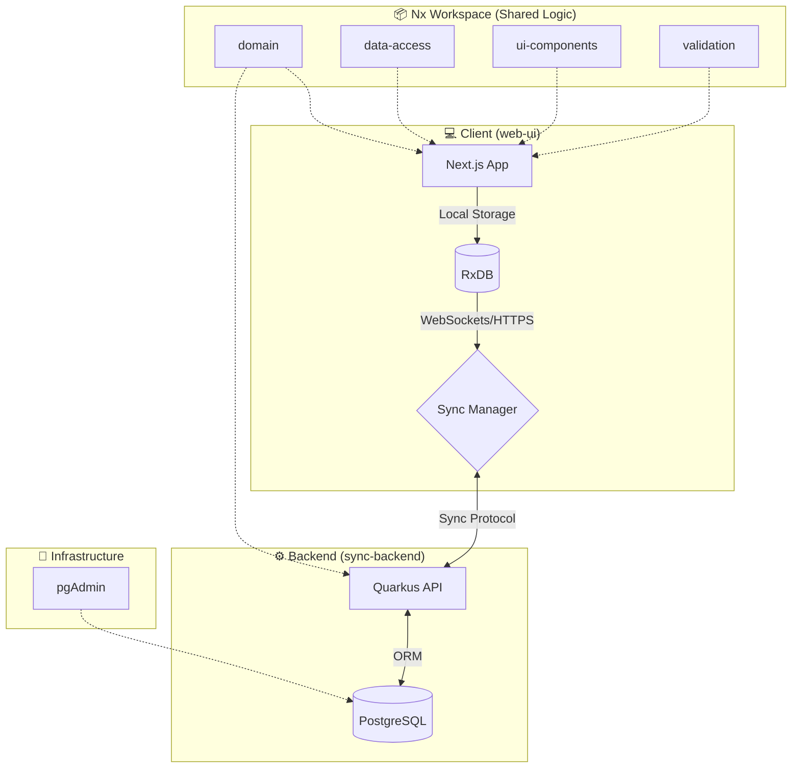

# 🚀 JobTracker: Modern Job Application Management

[](https://nx.dev)
[](https://nextjs.org)
[](https://quarkus.io)
[](https://opensource.org/licenses/MIT)

**JobTracker** is a high-performance, offline-first monorepo application designed to streamline the job search process. Built with modern web technologies and a robust Java backend, it provides a seamless experience for tracking companies, contacts, roles, and interview events.

---

## 🏗️ System Architecture

JobTracker utilizes a modern, distributed architecture optimized for developer experience and offline resilience.



---

## 🏗️ Nx Monorepo

This project is managed as an **Nx Monorepo**, providing a unified workflow for frontend, backend, and shared libraries.

### Key Benefits
- **Shared Logic:** The `domain` and `validation` packages ensure that data structures and business rules are identical between the Java backend and TypeScript frontend.
- **Affected Commands:** Nx intelligently tracks changes. Running `npx nx affected:test` only runs tests for the projects you modified.
- **Dependency Graph:** Visualize how your code is interconnected:
  ```bash
  npx nx graph
  ```
- **Consistent Tooling:** Single `package.json` for all Node-based tools, unified linting, and formatting rules.

---

## 🐳 Containerization & Environment

JobTracker is built to be "Environment Agnostic" using Docker and VS Code Dev Containers.

### 🛠️ Dev Containers (VS Code)
The project includes a `.devcontainer` configuration that automatically sets up:
- **Runtimes:** Java 21 & Node.js 24.
- **Tooling:** Nx CLI, Maven, Playwright, and specialized VS Code extensions (ESLint, Prettier, Java Pack).
- **Automation:** Automatically runs `npm install` and installs Playwright browsers upon container creation.

### 📦 Docker Compose Services
The `docker-compose.yml` orchestrates the local development infrastructure:
- **`db`**: PostgreSQL 16 database.
- **`pgadmin`**: Web-based database management (accessible at `http://localhost:5050`).
- **`sync-backend`**: Hot-reloading Quarkus instance.
- **`dev`**: The VS Code development environment itself.

---

## 🛠️ Getting Started

### 💻 Development Environment Setup
This project is optimized for development on **Windows 11 (WSL2)** or **Linux/macOS** using **Docker Desktop**.

1.  **Clone the Repository:**
    ```bash
    git clone https://github.com/your-repo/job-tracker.git
    cd job-tracker
    ```
2.  **Open in VS Code:**
    - Launch VS Code in the project root.
    - When prompted, click **"Reopen in Container"**.
    - *Wait for the build to finish; this may take a few minutes on the first run.*
3.  **Environment Variables:**
    - Copy `.env.sample` to `.env` and adjust if necessary.

### 🏃 Running the Application
Use Nx to run the development servers:

```bash
# Start the web frontend (http://localhost:3000)
npx nx dev web-ui

# Start the sync backend (http://localhost:8080)
npx nx dev sync-backend
```

---

## ✨ Points of Interest

- **Offline-First Synchronization:** Leverages RxDB to provide a snappy, local-first experience that syncs automatically when online.
- **Type Safety:** Comprehensive TypeScript and Zod integration from frontend to shared logic.
- **Cloud-Native Backend:** Quarkus provides lightning-fast startup times and low memory footprint.
- **Unified Design System:** Shared UI components using Tailwind and daisyUI.

---

## 🛠️ Troubleshooting

### 🛑 Permission Issues in `sync-backend`
If you encounter a `FileSystemException: Operation not permitted` in the backend:
```bash
sudo chown -R $(id -u):$(id -g) apps/sync-backend/target
```

---

*Built with ❤️ using Nx, Next.js, and Quarkus.*
