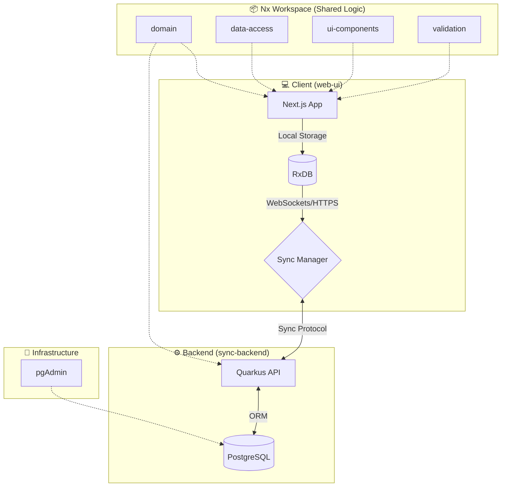

# 🚀 JobTracker: Modern Job Application Management

[](https://nx.dev)
[](https://nextjs.org)
[](https://quarkus.io)
[](https://opensource.org/licenses/MIT)

**JobTracker** is a high-performance, offline-first monorepo application designed to streamline the job search process. Built with modern web technologies and a robust Java backend, it provides a seamless experience for tracking companies, contacts, roles, and interview events.

---

## 🏗️ System Architecture

JobTracker utilizes a modern, distributed architecture optimized for developer experience and offline resilience.



## 📁 Project Structure

### 📱 Applications

- [**web-ui**](./apps/web-ui/README.md): Next.js frontend with RxDB for offline-first data management.
- [**sync-backend**](./apps/sync-backend/README.md): Quarkus-based synchronization server and API.

### 📦 Shared Libraries

- [**domain**](./packages/domain/README.md): Core entities, TypeScript types, and RxDB schemas.
- [**validation**](./packages/validation/README.md): Shared Zod validation schemas.
- [**ui-components**](./packages/ui-components/README.md): Reusable React components styled with Tailwind & daisyUI.
- [**hooks**](./packages/hooks/README.md): Shared React hooks for data access and application state.
- [**app-logic**](./packages/app-logic/README.md): Core business logic and process coordination.
- [**data-access**](./packages/data-access/README.md): Shared data fetching and persistence logic.

### 🐳 Infrastructure

- [**infrastructure**](./infrastructure/README.md): Database migrations (Flyway), PGAdmin configuration, and environment setup.

---

## 🏗️ Nx Monorepo

This project is managed as an **Nx Monorepo**, providing a unified workflow for frontend, backend, and shared libraries.

### Key Benefits

- **Shared Logic:** The `domain` and `validation` packages ensure that data structures and business rules are identical between the Java backend and TypeScript frontend.
- **Affected Commands:** Nx intelligently tracks changes. Running `npx nx affected:test` only runs tests for the projects you modified.
- **Dependency Graph:** Visualize how your code is interconnected:
  ```bash
  npx nx graph
  ```
- **Consistent Tooling:** Single `package.json` for all Node-based tools, unified linting, and formatting rules.

---

## 🐳 Containerization & Environment

JobTracker is built to be "Environment Agnostic" using Docker and VS Code Dev Containers.

### 🛠️ Dev Containers (VS Code)

The project includes a `.devcontainer` configuration that automatically sets up:

- **Runtimes:** Java 21 & Node.js 24.
- **Tooling:** Nx CLI, Maven, Playwright, and specialized VS Code extensions (ESLint, Prettier, Java Pack).
- **Automation:** Automatically runs `npm install` and installs Playwright browsers upon container creation.

### 📦 Docker Compose Services

The `docker-compose.yml` orchestrates the local development infrastructure:

- **`db`**: PostgreSQL 16 database.
- **`pgadmin`**: Web-based database management (accessible at `http://localhost:5050`).
- **`sync-backend`**: Hot-reloading Quarkus instance.
- **`dev`**: The VS Code development environment itself.

---

## 🛠️ Getting Started

### 💻 Development Environment Setup

This project is optimized for development on **Windows 11 (WSL2)** or **Linux/macOS** using **Docker Desktop**.

1.  **Clone the Repository:**
    ```bash
    git clone https://github.com/your-repo/job-tracker.git
    cd job-tracker
    ```
2.  **Open in VS Code:**
    - Launch VS Code in the project root.
    - When prompted, click **"Reopen in Container"**.
    - _Wait for the build to finish; this may take a few minutes on the first run._
3.  **Environment Variables:**
    - Copy `.env.sample` to `.env` and adjust if necessary.

### 🏃 Running the Application

For the best experience within the VS Code Dev Container, use these integrated commands:

> **Important:** Run these commands **inside the VS Code terminal** (the Dev Container).

```bash
# 1. First-time setup (migrations + build backend)
npm run setup

# 2. Start both Frontend and Backend
npm run start
```

---

## ✨ Points of Interest

- **Offline-First Synchronization:** Leverages RxDB to provide a snappy, local-first experience that syncs automatically when online.
- **Type Safety:** Comprehensive TypeScript and Zod integration from frontend to shared logic.
- **Cloud-Native Backend:** Quarkus provides lightning-fast startup times and low memory footprint.
- **Unified Design System:** Shared UI components using Tailwind and daisyUI.

---

## 🛠️ Troubleshooting

### 📊 PGAdmin Server Registration

If your database tables (like `sync_events`) are missing or you see sync errors:

1.  **Ensure `.env` is set up:** `cp .env.sample .env`.
2.  **Start the Backend:** Migrations only run when the `sync-backend` is active. Run `npm run start`.
3.  **Check Logs:** Look for Flyway logs in the terminal where you ran `npm run start`.

If you see permission errors when running `npm run setup` or if the backend fails to start:

1.  **Stop any existing containers.**
2.  **Fix permissions:**
    ```bash
    sudo rm -rf apps/sync-backend/target
    ```
    (The `sync-backend` Docker container sometimes creates files as `root`, which blocks the Nx dev server).
3.  **Avoid using the `sync-backend` container:**
    Running the backend directly in your Dev Container via `npm run start` is faster and more reliable for development.

### 📊 PGAdmin Server Registration

The `docker-compose.yml` is configured to automatically register the "JobTracker DB" in PGAdmin.

- **Login:** Use the credentials in your `.env` (default: `vscode@vscode.com` / `vscode`).
- **Access:** http://localhost:5050
- **Server:** "JobTracker DB" should already be listed in the left panel. (Note: You may still need to enter the database password `postgres_password` when first connecting).

### 🛑 Permission Issues in `sync-backend`

If you encounter a `FileSystemException: Operation not permitted` in the backend:

```bash
sudo chown -R $(id -u):$(id -g) apps/sync-backend/target
```

---

_Built with ❤️ using Nx, Next.js, and Quarkus._
